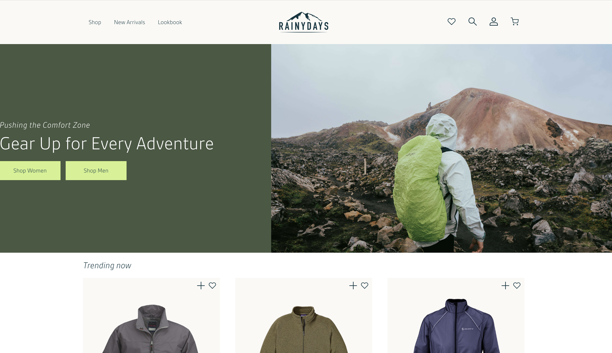

# HTML & CSS Course Assignment

A responsive website developed from a design prototype as part of the HTML & CSS course assignment.

## Description

This project was built to translate a design prototype into a fully functional and responsive website using semantic HTML and structured CSS.

The goal of the assignment was to practice building accessible, responsive layouts without using frameworks. The site follows DRY principles in the CSS structure and focuses on clean, readable code.

The project includes:

- Semantic HTML structure
- Responsive layout using Flexbox and CSS Grid
- Multiple pages based on the original site architecture
- Accessibility considerations following WCAG guidelines
- Testing across different screen sizes and devices

## Built With

- HTML
- CSS
- Flexbox
- CSS Grid

## Getting Started

### Installing

Clone the repository:

git clone https://github.com/8headswillroll8/html-css-lene.git

Open the project folder in your preferred code editor.

### Running

This is a static website and does not require a build process.

You can run the project by:

- Opening the folder in VS Code
- Running a local development server such as Live Server

You can also open `index.html` directly in your browser.

## Live Site

https://8headswillroll8.github.io/html-css-lene/

## Repository

https://github.com/8headswillroll8/html-css-lene

## Contact

- GitHub: https://github.com/8headswillroll8

## Acknowledgments

This project was developed as part of the HTML & CSS course at Noroff.
